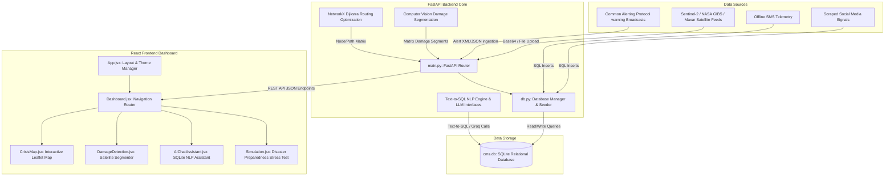

# Artificial-Intelligence-based-Crisis-Management-System

The Artificial Intelligence based Crisis Management System (AICMS) is an advanced, enterprise-grade emergency coordination and spatial-temporal analysis suite designed to empower disaster response authorities with real-time, actionable insights. By fusing satellite imagery, live social media streams, offline SMS feeds, and public broadcast warnings, AICMS delivers localized incident routing, shelter logistics, and pre-disaster simulations to minimize casualties and optimize humanitarian aid logistics.

---

## 1. System Architecture

The application is built on a decoupled Client-Server architecture utilizing a high-performance Python FastAPI backend, a responsive React-Vite frontend styled with utility CSS, and a relational SQLite database.

### Core Architecture Diagram



---

## 2. Core Intelligent Components

### A. Computer Vision Damage Segmentation
Integrated within the Damage Detection dashboard, the system processes high-resolution satellite imagery (Sentinel-2, NASA GIBS, Maxar, or custom drone/UAV uploads). A custom matrix-change segmentation algorithm detects changes between pre- and post-disaster spectral properties, calculating:
- Damage Coverage Percentage.
- Detailed Structural Impact breakdown.
- Roads, bridges, and infrastructure compromised by seismic cracks or water logs.

### B. Natural Language Processing (NLP) Engines
- **Distress Log Parsing**: Raw unstructured text from scraped social media streams and offline SMS lines are automatically parsed, categorizing urgent community requests (e.g. food, water, medicine, rescue) and assigning localized triage priorities (Critical, High, Medium, Low).
- **Text-to-SQL Database Chatbot**: Responders can query the SQLite operational database using natural language. The database NLP assistant parses the user question, constructs secure SQL SELECT queries (avoiding destructive statements), queries tables like shelters and CAP alerts, and summarizes findings instantly.

### C. NetworkX Routing Optimization
Using custom Dijkstra shortest-path algorithms mapped onto coordinates, the routing engine calculates the fastest, safest paths for humanitarian aid convoys:
- **Dynamic Obstacle Avoidance**: Automatically reroutes convoys if paths intersect active simulated disaster hazard circles.
- **Logistics Specifications**: Assigns crew sizes and vehicle restrictions (Heavy Cargo Convoy vs All-Terrain).
- **Security & Environmental Alerts**: Calculates path proximity to risk zones and tags route cards with safety advisories (e.g. Armed Escort Advised, Reduced Visibility).

---

## 3. Database Schema

The system uses an SQLite relational database (`cms.db`) pre-populated with highly dense, scenario-based datasets (150+ logs per table across flood, earthquake, cyclone, wildfire, and chemical leak scenarios).

| Table Name | Description | Key Fields |
|:---|:---|:---|
| **users** | System user credentials and authorization roles | `id`, `username`, `password`, `role` |
| **incidents** | Live reported active incidents, coordinates, and statuses | `id`, `title`, `description`, `scenario`, `latitude`, `longitude`, `severity`, `status`, `timestamp` |
| **shelters** | Evacuation shelters, capacities, occupancies, and resources | `id`, `name`, `latitude`, `longitude`, `capacity`, `current_occupancy`, `food_status`, `water_status`, `medical_status`, `sanitation_status`, `accessibility`, `status`, `contact`, `scenario` |
| **social_media** | Scraped distress messages mapped to community needs | `id`, `text`, `location`, `latitude`, `longitude`, `need`, `timestamp`, `scenario` |
| **sms_messages** | Offline emergency SMS messages with prioritized urgencies | `id`, `message`, `location`, `latitude`, `longitude`, `priority`, `timestamp`, `scenario` |
| **cap_alerts** | Standard Common Alerting Protocol warnings and metadata | `id`, `identifier`, `sender`, `sent`, `status`, `msg_type`, `scope`, `category`, `urgency`, `severity`, `headline`, `description`, `scenario` |

---

## 4. Software Operation Flow

1. **Dashboard Initialization**: The system starts, defaulting to the interactive **Crisis Map** displaying active Leaflet telemetry layers. Based on the selected disaster scenario, map markers and layers load dynamically.
2. **Imagery Fetching & Configuration**:
   - The user opens the **Damage Detection** tab.
   - If no imagery is loaded, the user enters a coordinate, selects a satellite service (Sentinel-2, Maxar, NASA), and captures the frame, or uploads a custom drone image file.
   - Once fetched, a collapsible top toolbar persists these settings, allowing the user to refetch or reconfigure coordinates seamlessly.
3. **AI Core Model Run**: The user triggers "Run Detection Model" or "Run Complete AI Analysis". The backend evaluates structural changes, generates a translucent segmented damage heatmap overlay, calculates metrics, and updates the database states.
4. **Contextual Decision Explanations**: The AI insights panel at the bottom automatically fetches custom reasoning tasks corresponding to the active page tab, updating calculations and action grids as the user navigates between maps, chats, or shelter logs.
5. **Interactive NLP Chatbot**: Emergency managers consult the AI Assistant for real-time inventories, such as querying shelters with low water resources or finding nearby critical incidents.

---

## 5. Execution Process

To run the full Artificial Intelligence based Crisis Management System locally, follow these instructions.

### Prerequisites
- Node.js (version 20.19+ or 22.12+)
- Python 3.9+
- Pip (Python Package Installer)

---

### Backend Setup & Execution

1. Navigate to the backend directory:
   ```bash
   cd backend
   ```

2. Create a virtual environment (optional but recommended):
   ```bash
   python -m venv venv
   source venv/bin/activate  # On Windows: venv\Scripts\activate
   ```

3. Install required Python packages:
   ```bash
   pip install -r requirements.txt
   ```

4. Configure environment variables. Create a `.env` file in the `backend` folder:
   ```env
   GROQ_API_KEY=your_optional_groq_llm_api_key_here
   ```
   *Note: If no API key is specified, the system automatically uses highly structured, fast mock heuristics and local rule-based SQL parsers to ensure full functionality.*

5. Initialize and seed the SQLite database:
   ```bash
   python db.py
   ```
   *Note: Directly running `db.py` resets the schema and populates all tables with 150+ realistic distress, CAP, and shelter entries.*

6. Start the FastAPI development server:
   ```bash
   uvicorn main:app --reload --port 8000
   ```
   The backend API will now be running at `http://localhost:8000`.

---

### Frontend Setup & Execution

1. Navigate to the frontend directory:
   ```bash
   cd frontend
   ```

2. Install Node dependencies:
   ```bash
   npm install
   ```

3. Start the Vite React development server:
   ```bash
   npm run dev
   ```
   Open your browser and navigate to `http://localhost:5173` to interact with the full dashboard.

4. Build production bundle (optional):
   ```bash
   npm run build
   ```
   Compiles optimized production files directly into the `dist/` directory.
